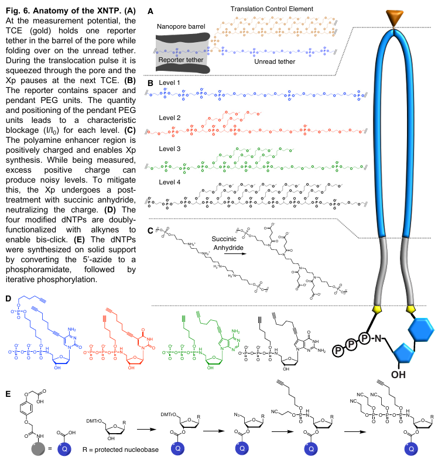
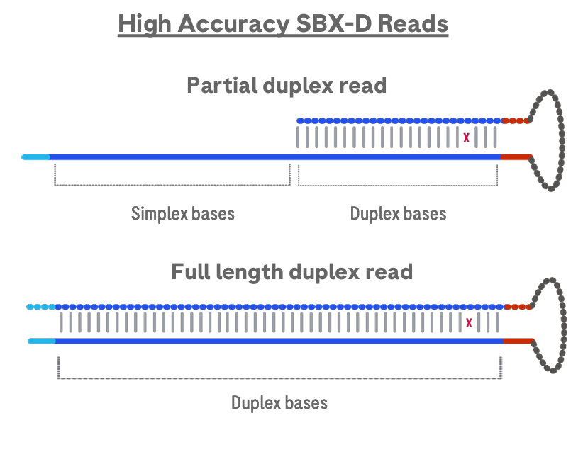
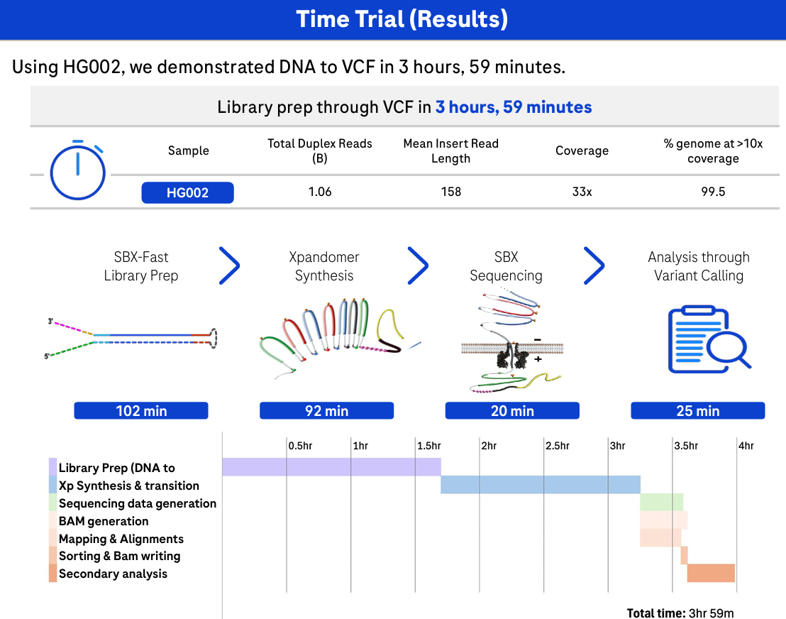
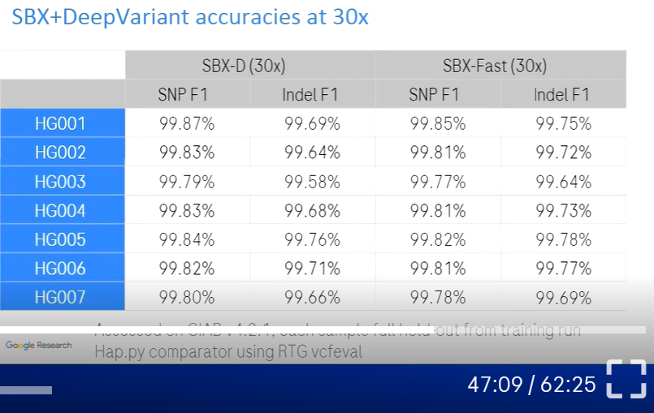

# Benchmarking Roche Axelios GIAB Data with Hap.py

## Project Overview
Introduce the new Roche Axelios technology and demonstrate its variant-calling performance using Genome in a Bottle (GIAB) reference data.

## Timeline
- 2007 - SBX technology invented at Stratos Genomics, Inc.
- 2020 - aquisition by Roche
- 2025 - SBX technology unveiled
- June 2026 - launch of AXELIOS 1
- 

---

## Theoretical Background
### SBX Technology 
**S**equencing **b**y **e**xpansion (SBX, 2007) uses DNA as a template to create a surrogate molecule called an **Xpandomer**.
- **Reported Speed:** 
  - 7 genomes per hour at >30x depth. 
  - 16 human genomes in 5.5h, 64 genomes a day. 30x median deduplicated concordant duplex base coverage. See: [product page](https://diagnostics.roche.com/global/en/products/systems/axelios-1-sys-597.html#:~:text=The%20sensor%20module%20is%20at%20the%20heart,on%2Ddeck%20to%20automate%20preparation%20for%20subsequent%20runs.)
  - 1.8T of duplex data in 4h
  - Xpandomer synthesis (4h), Sequencing run (5,5h)
  - 
- **Flexible Length:** Ranges from 100 bp to over 500 bp, as reported in the webinar.
  - Launch annoucment: "up to 1500"
  - ~200bp to ~1500 bp; mean insert length ~ 230 to 260 bp [Product description](https://diagnostics.roche.com/global/en/products/systems/axelios-1-sys-597.html#:~:text=The%20sensor%20module%20is%20at%20the%20heart,on%2Ddeck%20to%20automate%20preparation%20for%20subsequent%20runs.)
- implemented in AXELIOS
  - next-gen, single-molecule sequencing platform
  - reusable CMOS sensor (complementary metal–oxide–semiconductor)

- in comparison to Illumina, synthesis and Measurement are decoupled.
#### Xpandomer Anatomy:
50x longer than the original molecule
- **Translocation Control Element (TCE):** Holds or stops a sequence in the barrel so the current can be measured. A high-voltage pulse releases the Xpandomer, precisely advancing it to the next TCE.
- **Reporter:** Designed to have four distinct ion current level responses, but with similar voltage-pulse translocation control.
- **Acid-Cleavable Bond:** cleaved before sequencing
- **dNTP**
- **Enhancer:** Polyamines, which are necessary for incorporation by the Xp Synthase.

### Duplex and Simplex Modes
Double-stranded DNA is connected by a hairpin, unraveled, and sequenced simultaneously. This intramolecular consensus calling results in three possible quality scores:
- **75% yield `H`~Q38:** Concordant basepair (double coverage). *Note: Only these are used in downstream analysis.*
- **24% yield `7`:** Simplex mode (single coverage).
- **1% yield `&`:** Discordant basepair (mismatch).

### SBX-Fast
Ultra-rapid application, amplificaiton-free solo run for 20 minutes with 30x

#### Quirks of Roche Benchmark Pre-filtering
When counting ALT/REF in homopolymer or tandem repeat (HP/TR) regions, reads are filtered out if:
- They do not span the entire region in DUPLEX mode.
- There is a discordant base.
- **Pan-genome aware consensus calling:** If the pangenome supports one mate from a discordant basepair, that mate is chosen and assigned a higher quality score.

---

## Tool Compatibility
Due to single-end reads and variable insert sizes, the following tools are **not recommended**:
- Picard MarkDuplicates (reads of different lengths ending at the same position are incorrectly marked as duplicates)
- samtools pileup
- FastQC
- Standard sequencing metrics tools
- UMI-based consensus callers

The following tools **are compatible** with some optimization:
- IGV (>2.19.6)
- HaplotypeCaller
- Mutect2
- DeepVariant
- GRIDSS or Manta
- ExpansionHunter

*Note: Ultimately, the XOOS provides solutions for standard analysis.*

---

## AXELIOS SBX Analysis Strategy
- **Multiplexing:** Unclear: Xpandomer synthesis on up to 4 library pools in parallel, then a sequential processing.

The sequencer executes several steps in parallel to the flow run, providing:
*4 hour sequencing time and 16 SBX-D human whole genome samples, and include transfer times observed when using a dedicated 10 Gbps line and transferring to local storage*

- **Standard raw reads**- compressed 2,5TB delivered in ca 6,5-11hrs
- **Consensus reads** - compressed 1,2TB delivered in ca 5-6,5hrs 
- **Mapped/Aligned reads**  - compressed 1,3TB delivered in ca 5,5hrs. Fastest because of the size - compressing and copying
  - Sorted BAM files are available in under 1 minute after completion (for an SBX solo run).
  - Mapping to the pangenome is handled by XOOS (Giraffe-based).
- **INTRA- vs. INTER-molecular Consensus Quality Scores:**
  - Intra-molecular scores have three levels: `H`, `7`, and `&`.
  - Inter-molecular consensus is estimated by the Read Collapser.

### XOOS 
XOOS is a collection of secondary-analysis modules for SBX sequencing data. Each module is a self-contained tool with its own CLI and Docker image. 

End-to-end pipeline: Nextflow pipelien (`xoosnf`). User can customize or extend. It can run on standalone server, an HPC cluster, or in the cloud.
- **SBX-D Germline WGS**
- SBX-D Somatic Tumor/Normal WGS
- SBX-D cell-free DNA WGS

#### Modules

| Module | Description |
|--------|-------------|
| **Demux** | Demultiplexes samples and trims adapters from raw reads; for duplex chemistries also performs consensus base calling. |
| **Read Collapser** | Clusters reads by genomic position and/or UMI, then either marks duplicates or generates consensus reads. Supports germline WGS and target enrichment (TE). |
| **Alignment Metrics** | Computes alignment and quality metrics from aligned SBX reads. |
| **Small Variant Caller**| Filters and re-genotypes small variants (SNVs and short indels) using a machine-learning model. |
| **Copy Number Caller** | Calls copy-number events and estimates purity/ploidy. |
| **STR Caller** | Genotypes and detects repeat expansions in short tandem repeats (STRs). |
| **Pan-Genome Consensus Caller** | Resolves duplex discordant bases using a pan-genome reference. |
| **Tumor Fraction Estimator** | Estimates tumor fraction and detects sample contamination. |

XOOS utilizes an optimized version of **DeepVariant**:
- Sequencing read data is converted into an image-like representation.
- **Optimization for SBX-D and SBX-Fast:**
  - Utilizes a De Bruijn graph to identify potential haplotypes. The inclusion of any 1- or 2-base pair insertion requires at least 8% read evidence.
  - The parameter `ws_min_base_quality` used for realignment is increased from 20 to 25.
  - Based on Release v.10.

---

# Benchmarking

## Data Sources
In March 2026, Roche published 30x coverage GIAB VCFs, following their initial presentation in a September 2025 webinar. 
- **VCFs Data:** [Webinar GIAB XOOS VCFs 30x Duplex](https://web.sbxdata.kamino.platform.navify.com/files/030626-Webinar-GIAB-XOOS-VCFs-30x-Duplex/) *(registration required)*
- **Webinar:** [SBX Data Analysis Webinar](https://diagnostics.roche.com/global/en/events/sbx-d-data-analysis-webinar.html#video)

## Tools and Configuration
### Hap.py (Illumina)
[Hap.py GitHub Repository](https://github.com/Illumina/hap.py)
- **Truth Data:** NIST v4.2.1 from [NCBI](https://ftp-trace.ncbi.nlm.nih.gov/ReferenceSamples/giab/release/)
- **Reference Genome:** hg38 from [UCSC](https://hgdownload.soe.ucsc.edu/goldenPath/hg38/bigZips/)
- **Additional Flags:**
  - `--engine=vcfeval` for better "local alignment" of variable regions. Groups and restructures variant calls to eliminate false positives.
## Results
### Inhouse 
Downsampled 30x

| Sample | Variant Type | Recall | Precision | F1 Score |
| :--- | :--- | :---: | :---: | :---: |
| **HG001** | SNP   | 99.74% | 99.87% | 99.80% |
| **HG001** | INDEL | 99.46% | 99.69% | 99.57% |
| **HG002** | SNP   | 99.63% | 99.87% | 99.75% |
| **HG002** | INDEL | 99.39% | 99.68% | 99.54% |
| **HG003** | SNP   | 99.59% | 99.83% | 99.71% |
| **HG003** | INDEL | 99.34% | 99.60% | 99.47% |
| **HG004** | SNP   | 99.60% | 99.88% | 99.74% |
| **HG004** | INDEL | 99.45% | 99.70% | 99.57% |
| **HG005** | SNP   | 99.61% | 99.88% | 99.74% |
| **HG005** | INDEL | 99.57% | 99.78% | 99.67% |
| **HG006** | SNP   | 99.60% | 99.87% | 99.73% |
| **HG006** | INDEL | 99.47% | 99.74% | 99.60% |
| **HG007** | SNP   | 99.58% | 99.83% | 99.71% |
| **HG007** | INDEL | 99.45% | 99.66% | 99.55% |

Full samples

| Sample | VariantType | Recall | Precision | F1 Score |
| :--- | :--- | :---: | :---: | :---: |
| **HG001** | SNP | 99.77% | 99.88% | 99.83% |
| **HG001** | INDEL | 99.70% | 99.81% | 99.75% |
| **HG002** | SNP | 99.67% | 99.89% | 99.78% |
| **HG002** | INDEL | 99.69% | 99.84% | 99.76% |
| **HG003** | SNP | 99.58% | 99.87% | 99.72% |
| **HG003** | INDEL | 99.58% | 99.73% | 99.65% |
| **HG004** | SNP | 99.63% | 99.90% | 99.76% |
| **HG004** | INDEL | 99.68% | 99.82% | 99.75% |
| **HG005** | SNP | 99.64% | 99.90% | 99.77% |
| **HG005** | INDEL | 99.75% | 99.85% | 99.80% |
| **HG006** | SNP | 99.62% | 99.89% | 99.76% |
| **HG006** | INDEL | 99.69% | 99.85% | 99.77% |
| **HG007** | SNP | 99.60% | 99.85% | 99.73% |
| **HG007** | INDEL | 99.66% | 99.76% | 99.71% |

### Claimed by Roche

---

## Further Resources
- [bioRxiv Preprint on SBX Technology (March 2025)](https://www.biorxiv.org/content/10.1101/2025.02.19.639056v1.full.pdf)
- [Poster: Duplex Sequencing by Expansion](https://sequencing.roche.com/content/dam/diagnostics_microsites/sequencing/master-blueprint/en/resources/pdfs/posters/redefining-nanopore-sequencing-w-duplex-sequencing-by-expansion-SBX-D.pdf)
- [Roche DeepVariant Whitepaper (2026)](https://diagnostics.roche.com/content/dam/acadia/whitepaper/399/588/SBX002_Google%20DV%20white%20paper_v1-0-0326.pdf)
- [Launch of AXELIOS, June 2026](https://www.roche.com/media/releases/med-cor-2026-06-29)
- [AXELIOS 1 data analysis, June 2026](https://diagnostics.roche.com/global/en/diagnostics-insights/sbx-data-analysis-resources.html)
- [XOOS doc pages](https://roche-axelios.gitbook.io/xoos/overview/getting-started)